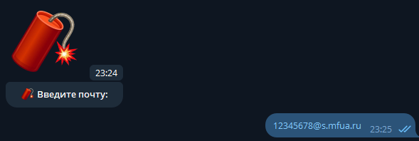
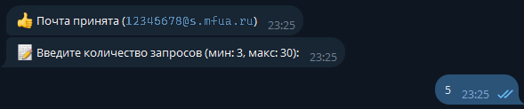
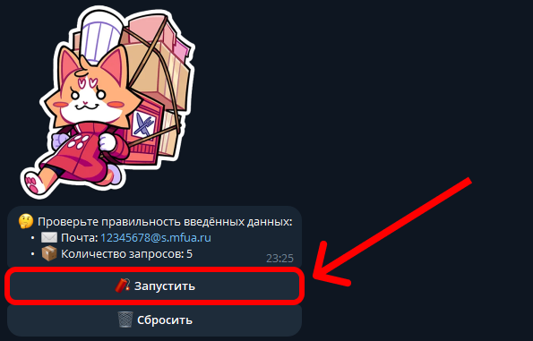
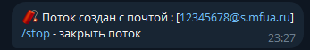

# Инструкция по  🧨MFUA_splash.py
спецально для [@mfua_splash_bot](https://t.me/mfua_splash_bot)

## Навигация
* [Как пользоваться ботом?](#как-пользоваться-ботом)
* [Где взять почту](#где-можно-взять-почту)
* [Где узнать ФИО](#как-узнать-фио-преподователя)
* [Поддержать Автора](#как-поддержать-автора)

## Как пользоваться ботом?
Всё проще чем кажется  
 <b>1. Нажимаем '🧨 Начать'</b>  

 <b>2. Далее вводим [почту](#где-можно-взять-почту), на которой будут приходить временные коды</b>  

 <b>3. Далее вводим количество запросов (кол-во временных кодов, которые будут отправлены)</b>  

 <b>4. Теперь проверяем данные, и нажимаем '🧨 Запустить'</b>  

 <b>5. Далее можем дождаться конца потока, или завершить досрочно командой <code>/stop</code></b>  

 <b>6. Поток завершён, это означает что всё хорошо</b>  

  

## Где можно взять почту?
<b>1. Заходим в свой аккаунт, после нажимаем на 'Почту студента'</b>  

 <b>2. После захода в 'Microsoft Outlook' мы нажимем на поиск</b>  

 <b>3. Вводим туда [ФИО](#как-узнать-фио-преподователя) преподователя, и нажимем на его профиль</b>  

 <b>4. После этого мы увидим его "РАБОЧУЮ" почту (она нам и нужна)</b>  

 <b>После этого можно использовать нашего бота 😉</b>  
<b>[Как пользоваться ботом?](#как-пользоваться-ботом)</b>  

  

## Как узнать ФИО преподователя?
<b>Есть в вообщем 2 варианта</b>  
1 - Просто спросить ФИО преподавателя в деканате, или у самого преподавателя  
2 - удалённо через сайт MFUA  

 

<b>Просто заходим в расписание и заходим в предмет, который видит наш преподаватель</b>  

  

## Как поддержать Автора?
Его можно поддержать, купив кофе через [DonateAlerts](https://www.donationalerts.com/r/tot_camyi_coder)  
Автор будет очень благодарен любому донату  

  
почта для связи: mfua.crack@gmail.com
